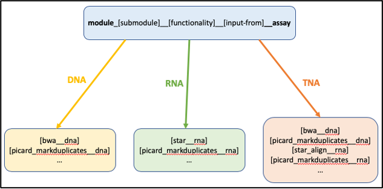

# cc-config-templates
Configuration file templates for CloudCounductor 

## Graph Configuration Template
Tasks should be named according to the following convention:

`module_[submodule]__[functionality]__[input-from]__assay`

## Resource Configuration Template
Coming soon..

## Platform Configuration Template
Coming soon..
